# Lab 4: IR Remote Control Texting Over an Asynchronous Serial (UART) Link

## Introduction

In this lab, students will utilize the Saleae logic analyzer and an IR receiver module to characterize the transmissions when pressing some buttons on an AT&T IR remote control for a specific TV code. After decoding the respective waveforms generated after pressing 12 different buttons (i.e., `0`, `1`, `2`, `3`, `4`, `5`, `6`, `7`, `8`, `9`, `LAST` and `MUTE`), we are able to know which button on the remote control is pressed, before writing a program which uses interrupts to monitor the signal from the IR receiver module and use the remote control to compose messages using the [Multi-Tap Entry Systems](https://en.wikipedia.org/wiki/Multi-tap) to send text messages back and forth between two CC3200 LaunchPad boards over an asynchronous serial (UART) communication channel. 

We have also gone extra miles to enable the user to include numbers (i.e., 0 - 9) when composing text messages. In addition, the OLED screen of the sender board will also show `Message sent successfully :)` after pressing `MUTE` to send a message. More details can be found in `Part 6. Innovation` below.

## Notable Equipment Required

1. Two CC3200 LaunchPad Boards
2. Two Adafruit OLED Breakout Boards
3. AT&T S10-S3 Remote Control
4. Vishay TSOP31336 or 1236 or 31236
5. 100Ω resistor
6. 100uF capacitor
7. Saleae logic analyzer

## Goals and Methods

### Part 1. IR Receiver Module Interface

We connect up the IR Receiver Module according to Figure 1 below. We include $R_{1}$ and $C_{1}$ to help filter noise which could arise on the power source and to protect against Electrical Over-Stress (EOS) from power supply variations. Note that the IR receiver draws very little current and hence we power it up directly from a processor board. 

<p align="center">
    
 </p>

<p align="center">Figure 1. Application Circuit Using the Vishay TSOP31336 IR Receiver Module (Taken from Datasheet)</p>

### Part 2. Remote Control Configuration

We follow the lab manual to reset the remote control to factory defaults followed by configuring it by programming the device code assigned to us (i.e., 1416). Now, we have a unique IR transmission encoding which avoids interference from other possible remote interrupts in the laboratory.

### Part 3. Capturing and Characterizing IR Transmissions Using a Saleae Logic

We use the Saleae logic analyzer to observe how the waveforms look like, decode and print them out for each of the 12 different buttons (i.e., `0`, `1`, `2`, `3`, `4`, `5`, `6`, `7`, `8`, `9`, `MUTE` and `LAST`) on the serial terminal. 

The pictures of waveforms for all the buttons of interests are displayed below:

<p align="center">
    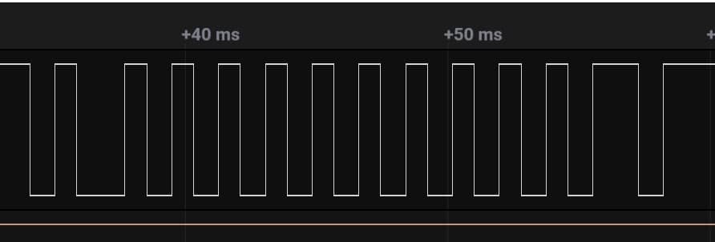
 </p>

<p align="center">Figure 2. Waveform of Button "1"</p>
<p align="center">
    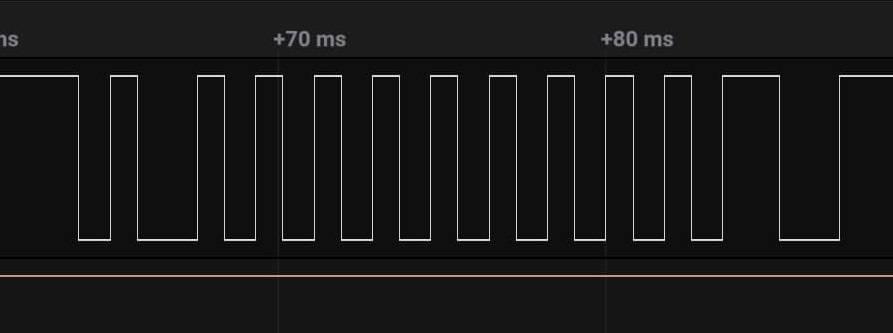
 </p>

<p align="center">Figure 3. Waveform of Button "2"</p>
<p align="center">
    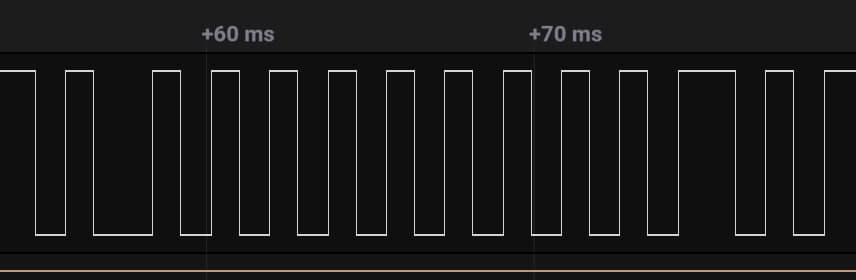
 </p>

<p align="center">Figure 4. Waveform of Button "3"</p>
<p align="center">
    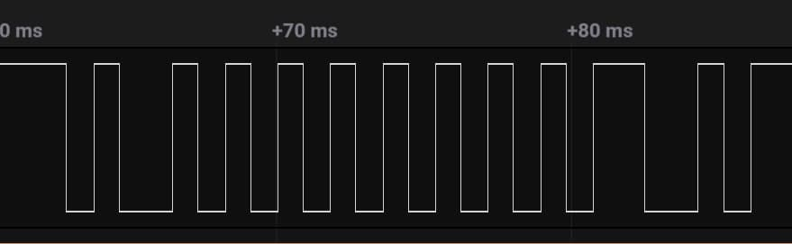
 </p>

<p align="center">Figure 5. Waveform of Button "4"</p>
<p align="center">
    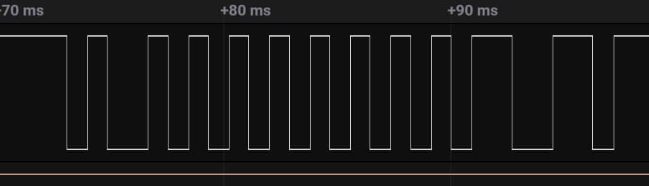
 </p>

<p align="center">Figure 6. Waveform of Button "5"</p>
<p align="center">
    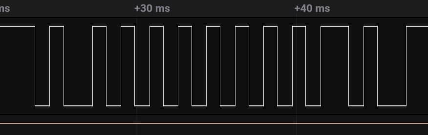
 </p>

<p align="center">Figure 7. Waveform of Button "6"</p>
<p align="center">
    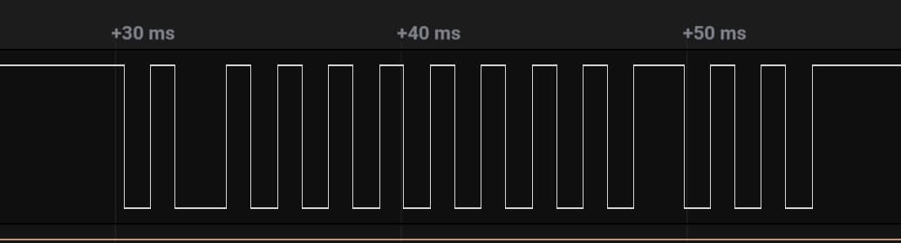
 </p>

<p align="center">Figure 8. Waveform of Button "7"</p>
<p align="center">
    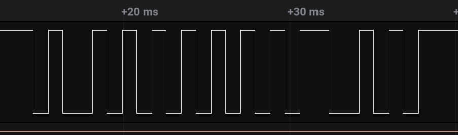
 </p>

<p align="center">Figure 9. Waveform of Button "8"</p>
<p align="center">
    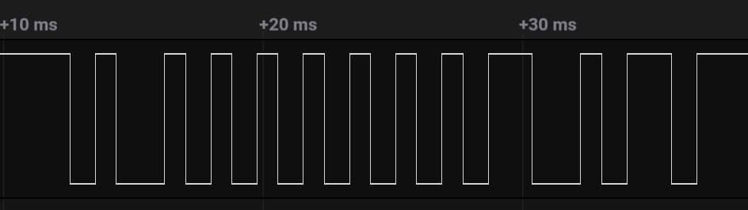
 </p>

<p align="center">Figure 10. Waveform of Button "9"</p>

<p align="center">
    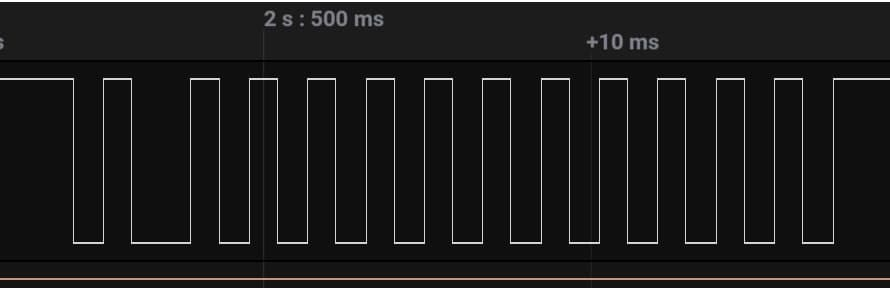
 </p>

<p align="center">Figure 11. Waveform of Button "0"</p>

<p align="center">
    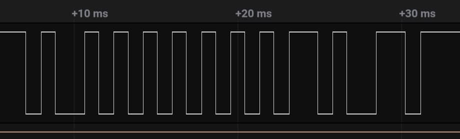
 </p>

<p align="center">Figure 12. Waveform of Button "MUTE"</p>

<p align="center">
    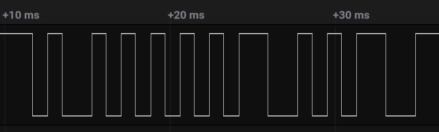
 </p>

<p align="center">Figure 13. Waveform of Button "LAST"</p>

### Part 4. Decoding IR Transmissions / Application Program

How we interpret the waveforms is rather interesting. Specifically, we found that the coding of the given AT&T remote control does not satisfy any existed coding standard, so we take the easiest and simpliest way to decode. We measure the interval between two rising edges and we get 3 different types. We coded those types in **ternary**, by its length of interval. For example:

<p align="center">
    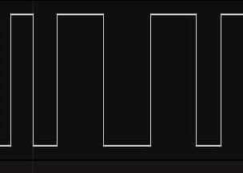
 </p>

<p align="center">Figure 14. Different intervals "0 2 1"</p>

Here is the full list of the transcribed code of each button:

```
Code mapping
1:              1000 0000 0001 
2:              1000 0000 002
3:              1000 0000 0010
4:              1000 0000 020
5:              1000 0000 021
6:              1000 0000 011
7:              1000 0000 0100
8:              1000 0000 200
9:              1000 0000 201
0:              1000 0000 0000
MUTE(ENTER):    1000 0000 111
LAST(DELETE):   1000 0020 02
```

To make the process precisely and automatically, we also monitor the internal system tick counter of CC3200 and wrote a debug routine to get the accurate interval in ticks. When the rising edge is detected and triggered the interrupt on GPIO pin, the counter will report the interval:

```c
static void GPIOA0IntHandler(void)
{ // PIN61 handler
    unsigned long ulStatus;

    ulStatus = MAP_GPIOIntStatus(pin61.port, true);
    MAP_GPIOIntClear(pin61.port, ulStatus);        // clear interrupts on GPIOA1
    pin61_intcount++;
    pin61_intflag = 1;

    if (g_ulTimerInts < 10)
    {
        gpioTimeCount = 0 + '0';

    }
    else {
        gpioTimeCount = 1 + '0';
    }
    strncat(gpioArr, &gpioTimeCount, 1);

    g_ulTimerInts = 0;
}
```

Also, we observe that the first two bits will toggle when the key is released and another key is pressed. So one key could have two code to interpret.

```
Code mapping (toggled)
1:              0100 0000 0001 
2:              0100 0000 002
3:              0100 0000 0010
4:              0100 0000 020
5:              0100 0000 021
6:              0100 0000 011
7:              0100 0000 0100
8:              0100 0000 200
9:              0100 0000 201
0:              0100 0000 0000
MUTE(ENTER):    0100 0000 111
LAST(DELETE):   0100 0020 02
```

However, due to the given requirement, it is not necessary to concern the difference of the toggled code. So, we convert the input string generated by interrupt handler to number in decimal. Therefore, our decoding logic is below:

```c
int decodeDEC()
{
    int code_DEC = 0;
    char * ptr;
    ptr = strchr(gpioArr, NULL);
    int s;
    s = strlen(token);

    code_DEC = strtol(ptr+1, NULL, 3);

    switch (code_DEC)
    {
    case 177148:
        Report("%d   %s      1 \r\n", strlen(gpioArr), gpioArr);
        return 1;                 //177148 - 59050
    case 177150:
        Report("%d   %s      3 \r\n", strlen(gpioArr), gpioArr);
        return 3;                //177150 - 59052
    case 177156:
        Report("%d   %s      7 \r\n", strlen(gpioArr), gpioArr);
        return 7;                 //177156 - 59058
    case 177147:
        Report("%d   %s      0 \r\n", strlen(gpioArr), gpioArr);
        return 0;                 //177147 - 59049
    case 59050:
        Report("%d   %s      1F \r\n", strlen(gpioArr), gpioArr);
        return 1;                 //177148 - 59050
    case 59052:
        Report("%d   %s      3F \r\n", strlen(gpioArr), gpioArr);
        return 3;               //177150 - 59052
    case 59058:
        Report("%d   %s      7F \r\n", strlen(gpioArr), gpioArr);
        return 7;                 //177156 - 59058
    case 59049:
        Report("%d   %s      0F \r\n", strlen(gpioArr), gpioArr);
        return 0;                 //177147 - 59049
    case 59051:
        Report("%d   %s      2 \r\n", strlen(gpioArr), gpioArr);
        return 2;                  //59051 - 19685
    case 59055:
        Report("%d   %s      4 \r\n", strlen(gpioArr), gpioArr);
        return 4;                //59055 - 19689
    case 59056:
        Report("%d   %s      5 \r\n", strlen(gpioArr), gpioArr);
        return 5;                //59056 - 19690
    case 59053:
        Report("%d   %s      6 \r\n", strlen(gpioArr), gpioArr);
        return 6;                //59053 - 19687
    case 59067:
        Report("%d   %s      8 \r\n", strlen(gpioArr), gpioArr);
        return 8;                  //59067 - 19701
    case 59068:
        Report("%d   %s      9 \r\n", strlen(gpioArr), gpioArr);
        return 9;                  //59068 - 19702
    case 59062:
        Report("%d   %s      ENTER \r\n", strlen(gpioArr), gpioArr);
        return 10;              //59062 - 19696
    case 19685:
        Report("%d   %s      2F \r\n", strlen(gpioArr), gpioArr);
        return 2;                  //59051 - 19685
    case 19689:
        Report("%d   %s      4F \r\n", strlen(gpioArr), gpioArr);
        return 4;                //59055 - 19689
    case 19690:
        Report("%d   %s      5F \r\n", strlen(gpioArr), gpioArr);
        return 5;                //59056 - 19690
    case 19687:
        Report("%d   %s      6F \r\n", strlen(gpioArr), gpioArr);
        return 6;                //59053 - 19687
    case 19701:
        Report("%d   %s      8F \r\n", strlen(gpioArr), gpioArr);
        return 8;                  //59067 - 19701
    case 19702:
        Report("%d   %s      9F \r\n", strlen(gpioArr), gpioArr);
        return 9;                  //59068 - 19702
    case 19696:
        Report("%d   %s      ENTER F \r\n", strlen(gpioArr), gpioArr);
        return 10;              //59062 - 19696
    case 19739:
        Report("%d   %s      DELETE \r\n", strlen(gpioArr), gpioArr);
        return 11;             //19739 - 6617
    case 6617:
        Report("%d   %s      DELETE F \r\n", strlen(gpioArr), gpioArr);
        return 11;             //19739 - 6617
    }


}
```

We have also made sure that only these 12 buttons with device code 1416 are recognized (i.e., other signals are effectively ignored). This is done by ...

To enable the Multi-Tap Entry Systems, we ...

For button `1` which is used to change colors, we simply use `colorCounter` to keep track of the current color, increment it by 1 (and switch to the next color) and if necessary, wrap it back to the initial color (this happens if the user presses `1` for more than 4 times).

```c
int colorCounter = 0;

void changeColor()
{
    switch (colorCounter)
    {
    case 0:
        currentColor = WHITE;
        break;
    case 1:
        currentColor = GREEN;
        break;
    case 2:
        currentColor = CYAN;
        break;
    case 3:
        currentColor = RED;
        break;
    case 4:
        currentColor = MAGENTA;
        break;
    }
    colorCounter++;
    if (colorCounter > 4)
    {
        colorCounter = 0;
    }
}
```

For button `LAST` which is used to delete a character, our logic is as follows, taking care of all corner cases:

```c
void deleteChar()
{
    currentMessageIndex -= 1;
    if (y == 120 && x == 0) // Line 1, at the start
    {
        fillRect(x, y, 5, 7, BLACK);
    }
    else // Any line, not at the start
    {
        x -= 6; // Move back "cursor"
        fillRect(x, y, 5, 7, BLACK); // Delete the current char
    }
}
```

For button `MUTE` which is used to send messages, the logic is presented in `Part 5. Board to Board Texting Using Asynchronous Serial Communication (UART)`

### Part 5. Board to Board Texting Using Asynchronous Serial Communication (UART)

We make use of UART1 to transmit and receive data between two CC3200 LaunchPad boards (note that UART0 is tied to the serial terminal which we use for debugging purposes). Our UART1 and corresponding interrupt initialization is as follows:

```c
MAP_UARTIntRegister(UARTA1_BASE, UARTIntHandler);
MAP_UARTEnable(UARTA1_BASE);
MAP_UARTConfigSetExpClk(PAIRDEV, MAP_PRCMPeripheralClockGet(PAIRDEV_PERIPH),
UART_BAUD_RATE,
                        (UART_CONFIG_WLEN_8 | UART_CONFIG_STOP_ONE |
                        UART_CONFIG_PAR_NONE));
MAP_UARTIntEnable(UARTA1_BASE, UART_INT_RX);
MAP_UARTIntClear(UARTA1_BASE, UART_INT_RX);
```

Next, our `UARTIntHandler` is implemented below. This interrupt will be triggered whenever data is received through UART1 RX.

```c
void UARTIntHandler()
{
    MAP_UARTIntDisable(UARTA1_BASE, UART_INT_RX);

    while (UARTCharsAvail(PAIRDEV))
    {
        char letter;
        char color;
        receiveMsg(letter, color);
    }

    MAP_UARTIntClear(UARTA1_BASE, UART_INT_RX);
    MAP_UARTIntEnable(UARTA1_BASE, UART_INT_RX);
}
```

Before we present how we process the received message and display it on the receiver board's OLED screen, we need to be sure how we intend to send the data (i.e., both the character and the color of the character). We keep it simple by only making use of two 1-D arrays of maximum size of `20`, namely, `charMessage` and `colorMessage`, which stores the character and its color respectively (the maximum "length" of the OLED screen is `120` and the distance between two consecutive characters is set to be `6`, we can hence obtain maximum number of characters in one line to be $\frac{120}{6} = 20$). In addition, we should let the receiver board know the last character of the data to be sent (so that it knows when to stop displaying the character(s) received). We do this by sending two `%` at the end. Also, since we can only send a character at a time and `colorMessage` in this case is different from the data type of the `color` argument in `drawChar` (i.e., `char` vs `unsigned int`), we send a char from `1` to `5` and decode it in the receiver end later. Thus, our logic for sending a series of characters together with their colors is as follows. Note that we can simply set `currentMessageIndex` to `0` after a message is being sent. The practice of `soft deletion` works as it is not necessary to `clean` both `charMessage` and `colorMessage`.

```c
int i = 0;

for (i = 0; i < currentMessageIndex; ++i)
{
    UartPairDevPutChar(charMessage[i]);
    switch (colorMessage[i])
    {
    case WHITE:
        UartPairDevPutChar('1');
        break;
    case GREEN:
        UartPairDevPutChar('2');
        break;
    case CYAN:
        UartPairDevPutChar('3');
        break;
    case RED:
        UartPairDevPutChar('4');
        break;
    case MAGENTA:
        UartPairDevPutChar('5');
        break;
    }

UartPairDevPutChar('%');
UartPairDevPutChar('%'); 

currentMessageIndex = 0;
```

Thus, `receiveMsg` is implemented as follows:

```c
void receiveMsg(char letter, char color)
{
    while (1)
    {
        letter = UartPairDevGetChar();
        color = UartPairDevGetChar();

        if (letter == '%' && color == '%')
        {
            y += 10;
            x = 0;
            continue;
        }

        if (color == '1')
        {
            color = WHITE;
        }
        else if (color == '2')
        {
            color = GREEN;
        }
        else if (color == '3')
        {
            color = CYAN;
        }
        else if (color == '4')
        {
            color = RED;
        }
        else
        {
            color = MAGENTA;
        }

        drawChar(x, y, letter, color, 0, 1);
        x += 6;

        if (y == 110)
        {
            fillScreen(BLACK);
            x = 0;
            y = 0;
        }
    }
}
```

### Part 6. Innovation

In our application, we want to assure the sender that his or her message is sent successfully. Hence, whenever the sender presses `MUTE` and after the message is cleared from the sender's OLED screen, it will display `Message sent successfully :)` in the center of the OLED screen. Below is the detailed implementation:

```c
char arr1[] = { 'M', 'e', 's', 's', 'a', 'g', 'e' };
char arr2[] = { 's', 'e', 'n', 't' };
char arr3[] = { 's', 'u', 'c', 'c', 'e', 's', 's', 'f', 'u', 'l', 'l', 'y',
                ' ', ':', ')' };

size_t n1 = sizeof(arr1) / sizeof(arr1[0]);
size_t n2 = sizeof(arr2) / sizeof(arr2[0]);
size_t n3 = sizeof(arr3) / sizeof(arr3[0]);
int j = 0;
int x1 = 37;

for (j = 0; j < n1; ++j)
{
    drawChar(x1, 0, arr1[j], WHITE, 0, 1);
    MAP_UtilsDelay(5000000);
    x1 += 6;
}

int x2 = 48;
for (j = 0; j < n2; ++j)
{
    drawChar(x2, 20, arr2[j], WHITE, 0, 1);
    MAP_UtilsDelay(5000000);
    x2 += 6;
}

int x3 = 13;
for (j = 0; j < n3; ++j)
{
    drawChar(x3, 40, arr3[j], WHITE, 0, 1);
    MAP_UtilsDelay(5000000);
    x3 += 6;
}

fillScreen(BLACK);
drawFastHLine(0, 110, 120, WHITE);
```

We also enable the user to type both letters and numbers using the remote control. To do this, we need to designate a button to toggle between `letterMode` and `numberMode` (in fact, we only make use of `letterMode` and toggle it between `1` and `0` to achieve the outcome). The decoding details are explained in the previous section and we are only required to assign numbers (rather than possible letters or functionalities) to the corresponding `0-9` button. 

## Challenges

During our development procedure, we have met many difficulties in function implementation and testing.

1. In our earlier testing process, we observed that a previously composed character will appear again. For instance, suppose we want to type "EC", we should press 3 and be able to press 2 immediately. However, the OLED sometimes shows "EEC" as a result. We resolved this issue by limit the receive buffer string exactly to the length of longest instruction (12 in our case) to avoid receiving partial of the next message. 
2. However, the limitation in length of receiving buffer makes the device sometimes not too responsive since some income message packages can be discarded. We improved responsiveness by minimizing the processing time in the GPIO interrupt handler to make sure every package can be catched.
3. The decoding system is low efficiency and not considering the bit toggle property due to the time constrint. The whole system is usable, but the algorithm can be significantly improved in future revisions.

## Conclusion

In this lab, we successfully finished all tasks listed in the lab manual and verified our design with our TA and was credited for our innovation. We have learnt the basics of how to use an IR receiver to receive signals and send data through UART1. In addition, we have gained exposure in programming multiple interrupts (i.e., timer interrupt, UART1 interrupt, GPIO interrupt). Also, we have been trained to interpret and decode waveforms generated after pressing a button of an AT&T IR remote control for a specific TV code. 